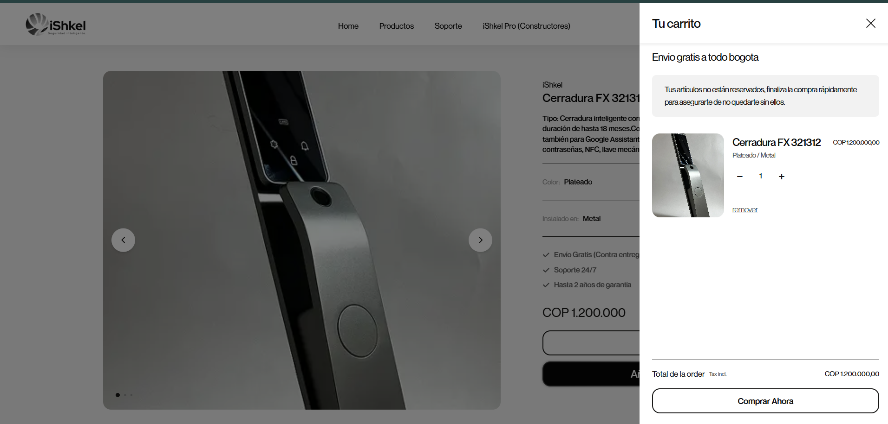
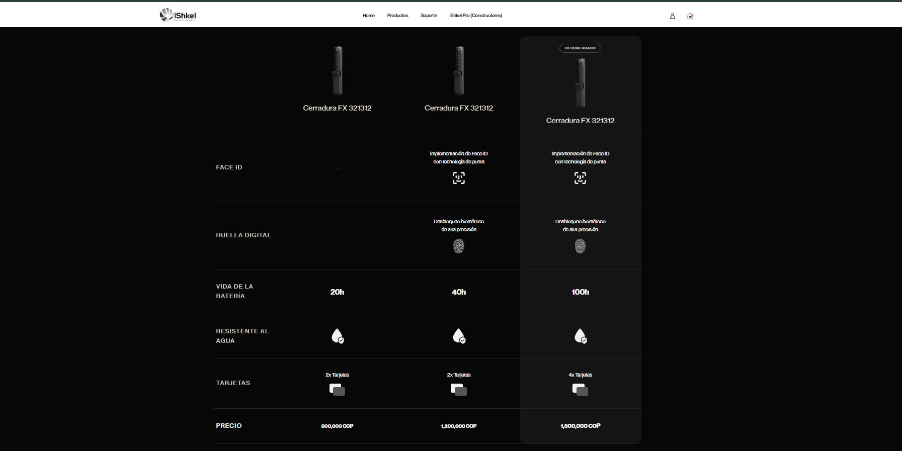
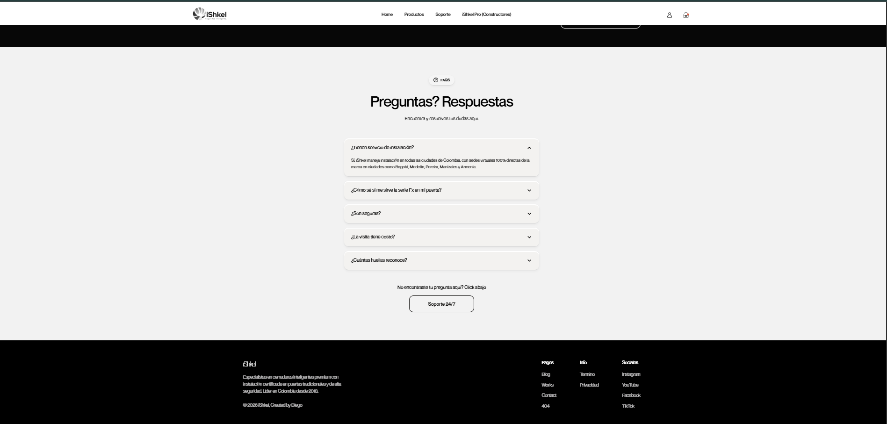

# iShkel — Smart Security Locks for Colombia

> Headless e-commerce storefront for a smart-lock brand entering the Colombian market. Custom Figma-designed frontend, Shopify Storefront API backend, built with Next.js, TypeScript, and Tailwind CSS.

**🔗 Live site:** [ishkel.com](https://ishkel.com)

---

## Screenshots

### Desktop








### Mobile


---

## About the Project

iShkel is a real commercial e-commerce brand selling smart security locks in Colombia. This repository contains the storefront — a fully custom frontend built from a Figma design and connected to Shopify as a headless commerce backend.

The project demonstrates end-to-end product development: design translation, component architecture, third-party API integration, state management, and production deployment.

---

## Tech Stack

**Frontend**
- [Next.js](https://nextjs.org/) (App Router) — React framework with server-side rendering
- [TypeScript](https://www.typescriptlang.org/) — type-safe development
- [Tailwind CSS](https://tailwindcss.com/) — utility-first styling
- [Framer Motion](https://www.framer.com/motion/) — animations and scroll-driven effects
- React Context — cart and global state

**Backend / Commerce**
- [Shopify Storefront API](https://shopify.dev/docs/api/storefront) — products, inventory, checkout
- GraphQL — queries use Shopify's `nodes` syntax

**Design & Tooling**
- Figma — source of truth for design
- Vercel — hosting and CI/CD
- Git / GitHub — version control

---

## Key Features

- **Pixel-accurate Figma → Code translation** with custom components: Hero, ProductShowroom, Collage, FounderQuoteSection, TestimonialSection (bento grid), AutoridadSection (animated SVG wave divider), ComparisonTable, FAQ accordion.
- **Responsive design** across desktop, tablet, and mobile breakpoints.
- **Shopify integration**: product fetching, cart context, drawer UI, add-to-cart flow, and checkout redirect.
- **Localised for Colombia**: all copy in Spanish, COP currency formatting, local market references.
- **Custom design system**: alternating black (`#000000` / `#070707`) and light (`#F3F3F3` / `#E8E8E8`) sections, 15px border radius, frosted glass UI (`bg-white/25 backdrop-blur-xl`), Neue Montreal typography.

---

## Architecture

```
Next.js (App Router) ──► Shopify Storefront API (GraphQL)
        │                          │
        ├── React Context           └── Products, Variants, Cart, Checkout
        │   (CartContext)
        │
        ├── Server Components       Vercel
        └── Client Components ◄── Deployment & Edge
```

**Key files:**
- `lib/shopify.ts` — Storefront API client and GraphQL queries
- `context/CartContext.tsx` — global cart state
- `components/` — reusable UI primitives (CartDrawer, ProductCard, and section components)
- `app/` — Next.js App Router pages and layouts

---

## Running Locally

### Prerequisites
- Node.js 18+
- A Shopify store with Storefront API access

### Setup

```bash
git clone https://github.com/juandmr01/ishkel.git
cd ishkel
npm install
```

Create a `.env.local` file in the project root:

```
NEXT_PUBLIC_SHOPIFY_STORE_DOMAIN=your-store.myshopify.com
NEXT_PUBLIC_SHOPIFY_STOREFRONT_ACCESS_TOKEN=your_storefront_access_token
```

> ⚠️ On Windows, create `.env.local` directly in VS Code (not via terminal redirection) to avoid UTF-16 encoding issues that break Next.js env parsing.

### Run

```bash
npm run dev
```

Open [http://localhost:3000](http://localhost:3000).

---

## Engineering Notes

A few decisions and trade-offs worth flagging:

- **Headless over Hydrogen.** Chose Next.js + Storefront API over Shopify's Hydrogen framework for full control over routing, design, and the ability to extend beyond e-commerce later.
- **`nodes` over `edges` in GraphQL.** Shopify's newer Storefront API exposes `products { nodes { ... } }` directly, which is cleaner than the older edges/cursors pattern when pagination isn't needed.
- **Server components by default.** Client components only where interactivity requires it (cart, drawers, forms) to keep the bundle lean.
- **Tailwind with custom utility classes** for repeated patterns (e.g. `.gradient-text-gold`) rather than inline style repetition.

---

## Roadmap

- [ ] Product detail pages with variant selection
- [ ] Checkout flow polish and Spanish-language confirmation states
- [ ] Customer accounts and order history
- [ ] Localised SEO metadata for Colombian search

---

## About the Developer

Built by **Diego Martinez** — Computer Science and Mechatronics Engineering student at QUT (Brisbane, Australia), based in Australia, building for the Colombian market.

- LinkedIn: [linkedin.com/in/juandmr11](https://www.linkedin.com/in/juandmr11)
- Email: juandmartinez1001@gmail.com

---

## License

Proprietary. All rights reserved. This codebase is shared publicly for portfolio purposes; the iShkel brand, design, and product copy are not licensed for reuse.